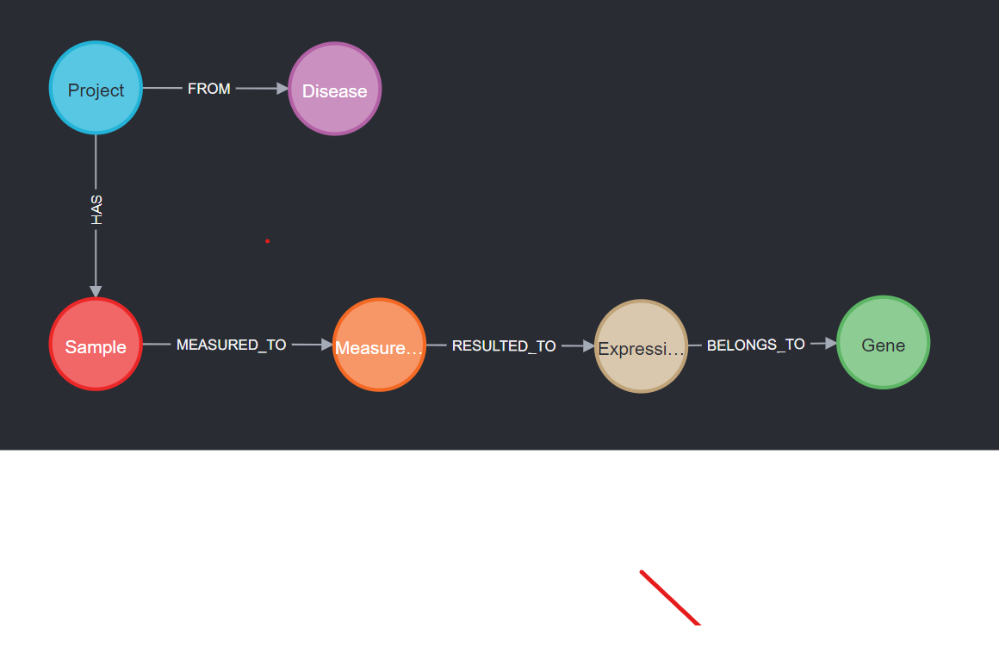

# CeIA - A tool for automatic GDC cancer data extraction, storage and anaylsis using neo4j and LLM
** **Under development** **


This tool is being designed for retrieval, extraction, integration and analysis of GDC public cancer data. 
It currently focuses on mRNA and miRNA data and further integrates experimental metadata. 
In the backend CeIA uses neo4j to store the data in pre-defined datamodel which can be altered.     
 
## How to run the tool and pipeline
Lets start with 
> git clone https://github.com/peeyushsahu/CEIA.git

Goto the CeIA folder, we will use main.py to do some initial settings for database creation and data download.

### Configure neo4j database
First create a neo4j database using neo4j desktop or create one using neo4j docker image.
Only thing we want, is an exposed bolt port to connect.

````
NEO4J_HOST = os.getenv('NEO4J_HOST', 'localhost or ip address of remote machine')
NEO4J_PORT = os.getenv('NEO4J_PORT', 7687 or exposed bolt port)
NEO4J_PASSWORD = os.getenv('NEO4J_PASSWORD', 'password for neo4j database')
OUTPUT_DIRECTORY = os.getenv('OUTPUT_DIRECTORY', 'path_to_download_the_GDC_data')
````

### Configure GDC data download
There are two parameters which can be configured right now.
1. primary site: this is the primary site of cancer, e.g. blood, lung
2. output size: currently this limits the number of records to be downloaded, later versions will have an incremental download.

````
meta_file_name = gdc_api.bulk_download(primary_site='Blood',
                                       experiment_strategy=['RNA-Seq', 'miRNA-Seq'],
                                       file_format="TSV",
                                       outdir=OUTPUT_DIRECTORY,
                                       output_size=40)
````

### Upload the data
Here nothing need to be done. Following command will start the data extraction and upload to neo4j db.

````
gdc_upload.get_metadata(datadir=OUTPUT_DIRECTORY, filename=meta_file_name, graph=driver)
````

### Run pipeline
Finally the initial pipeline can be started with,
````
python3 main.py
````

## How does the datamodel looks like
We have created a small and simple data model to store and access data. Following is a meta graph prepared by the neo4j apoc plugin.

